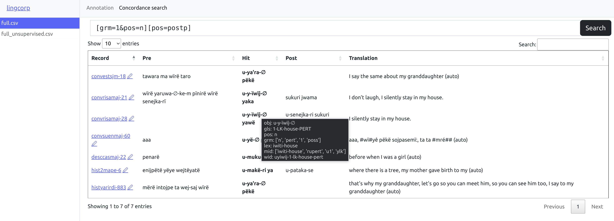

# lingcorp
WIP

## Corpus annotation
Your project directory should contain `input` and `output` directories, as well as a `conf.py` file.
That configuration file describes the annotation setup.
lingcorp requires two variables: `pipeline` and `config`.

### The pipeline
The pipeline (called so for historical reasons) is a list of configurable fields and dynamic annotator objects.

## Concordance search
The search uses a simplified version of the [corpus query language](https://www.sketchengine.eu/documentation/corpus-querying/).
This allows searching for multiple tokens, each specified for an arbitrary number of parameters.

